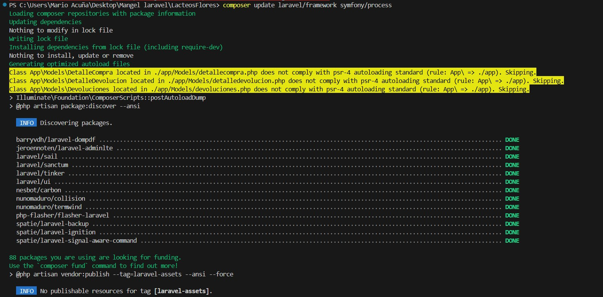

. **Diagnóstico de las vulnerabilidades
El proceso comenzó con la identificación de dos vulnerabilidades de seguridad en los paquetes de Symfony: una de **redirección abierta** (CVE-2024-50345) y otra, de mayor riesgo, de **secuestro de ejecución de comandos** (CVE-2024-51736).

---

### **Solución Exitosa**
La única forma de resolver el conflicto fue actualizar ambos paquetes de forma explícita. El comando que finalmente resuelve el problema es:
`composer update laravel/framework symfony/process`

* **Resultado:** Este comando le indica a Composer que actualice ambos paquetes a sus versiones más recientes y compatibles, lo que permite la instalación de la versión parchada de `symfony/process` y, al mismo tiempo, mantiene la integridad de todas las dependencias del proyecto.
