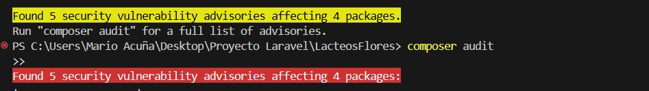

# Resumen de vulnerabilidades en el sistema web "Lácteos Flores"

Durante el análisis de seguridad del sistema web **Lácteos Flores**, se identificaron varias vulnerabilidades que podrían poner en riesgo la **integridad**, **confidencialidad** y **disponibilidad** de la plataforma.

Las fallas detectadas incluyen problemas relacionados con la **manipulación de datos**, **vulnerabilidades en librerías de terceros**, **exposición de información sensible** y **configuraciones inseguras** que podrían ser aprovechadas por atacantes para comprometer el sistema.


Estos hallazgos evidencian la necesidad de reforzar las medidas de seguridad mediante:

- **Actualización y parchado de dependencias afectadas**.
- **Validación y saneamiento adecuado de todas las entradas de usuario**.
- **Control de acceso más estricto a rutas y recursos críticos**.
- **Auditorías periódicas y seguimiento de buenas prácticas de seguridad**.

Implementar estas acciones contribuirá a **reducir los riesgos** y a **proteger tanto los datos de los usuarios** como la **operación general del portal web**.

## Solución aplicada

Para corregir la vulnerabilidad detectada en **league/commonmark**, se realizaron los siguientes pasos:

- Se verificó la versión actual del paquete para confirmar que estaba dentro del rango afectado (< 2.7.0).  
- Se actualizó la librería a la versión segura **2.7.0 o superior** mediante Composer:
  ```bash
  composer require league/commonmark:^2.7


Tras actualizar el paquete a una versión segura que corrige la vulnerabilidad, se volvió a ejecutar el análisis de seguridad del proyecto.  

Como se muestra en la imagen a continuación, la vulnerabilidad crítica ya no está presente:

- Antes: 7 vulnerabilidades  
- Después: 5 vulnerabilidades (la vulnerabilidad crítica asociada a league/commonmark fue corregida)
  ## Solución aplicada


Con la actualización aplicada, se eliminó la vulnerabilidad en `league/commonmark` que podía permitir un ataque de denegación de servicio, mejorando la seguridad del proyecto.

